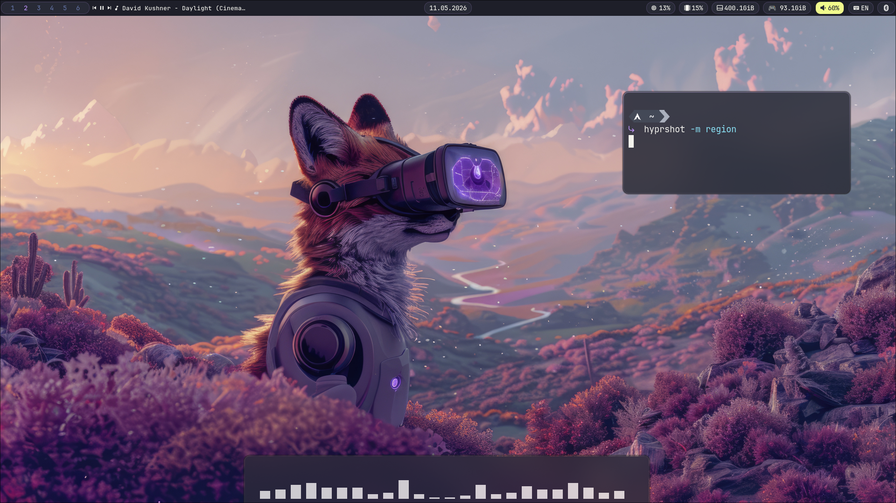

# 🌌 Hyprland Dotfiles

Моя персональная конфигурация Hyprland, настроенная на базе CachyOS. Чистый эстетичный вид, высокая производительность и полная интеграция всех необходимых утилит.

🛠 Компоненты системы
Конфиг автоматически подхватывает настройки для следующих инструментов:

Панель: Waybar (полная интеграция с конфигом)

Меню запуска: Rofi-wayland

Управление питанием: Rofi Powermenu

Блокировка экрана: Hyprlock (с поддержкой медиаплеера)

Обои: Waypaper + Awwwn

GTK Темы: nwg-look (по умолчанию установлена тема Dracula)

🚀 Установка

1. Устанавливаете хупрлэнд(я через cachyos или archinstall)

Если хотите прям чистый хупр,устанавливаете систему без окружения,у вас запустится терминал и там

вставляете: sudo pacman -S git yay micro hyprland waybar rofi-wayland waypaper nwg-look hyprlock awww
  
2. Клонирование репозитория

Склонируйте репозиторий в удобную папку: git clone https://github.com/Cixian227/Dotfiles-hyprland.git

3. Применение конфигурации
Просто скопируйте файлы в директорию .config вашего пользователя: cp -r Dotfiles-hyprland/* ~/.config/

4. Папку material_light_cursors перекидываете в .icons, которую создадите в домашей папке и примените в  nwg-look,хотя в конфиге у меня прописано и должен сам подхватиться)

🎨 Кастомизация
Все основные настройки находятся в папке ~/.config/hypr.

Если вам не нравится стандартная тема Dracula, вы можете легко сменить её через графический интерфейс nwg-look.

Обои меняются через Waypaper, который автоматически подхватит путь к изображениям из конфига.

⌨️ Горячие клавиши (Основные)

SUPER + Return — Терминал

SUPER + D — Меню приложений (Rofi)

SUPER + L — Заблокировать экран (Hyprlock)

SUPER + M — Выход/Питание

SUPER + V — Управление плавающими окнами

SUPER + Q — Закрытие приложения

SUPER + E — Проводник
